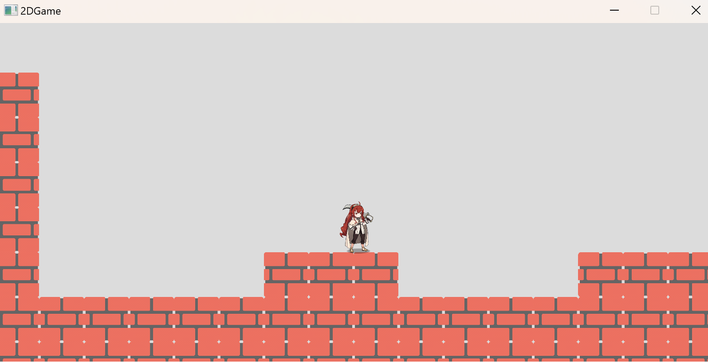

# Dev notes



## 1. Coordinates

### a. Tile coordinate:

(0, 0) at left bottom corner, x goes right and y goes up. Tile coordinate is generated by LevelMap.txt, 
and only has int coordinate value, float should not appear in tile coordinate.

- world coordinate -> tile coordinate:

    example: world pos (5.4, 6.3) -> tile pos (5, 6).


- tile coordinate -> world coordinate:

    example: tile pos (5, 6) -> world pos (5.0, 6.0).

### b. World coordinate:

Base on tile coordinates, x goes right and y goes up, which are same with tile coordinates.

- where is the center of object?
  
Center coordinate = tile coordinate + (width / 2, height / 2). 
If we create a box, whose size is 1 width and 1 height, located at tile position (3, 4), 
the world position of center should be (3.5, 4.5).

### c. Screen coordinate:

In SFML, screen coordinate let x goes right and y goes down, and x & y represent for pixels.
In game, the center of screen is always located at the center of player.


### d. How different coordinates mapping each other?

First of all, serval global variables should be confirmed.

- window width-height scale.

    This scale depends on how much view in game world that we want our users to see. Let's say we are going to let user have a view of 16 meters in x-axis, and 9 meters in y-axis of, so the screen width-height should be 16:9.

- window size.

    After we confirmed the scale of width-height, we can calculate the window size. Windows size is counting in pixel, and depends on the resolution of user's device.
    
    To make game looks same in every screens, we set our window width as about 70% of resolution width. For example, the resolution of device is 1920 * 1080, we do calculations in this order:

    - calculate window width: 1920 * 0.7 = 1344 (pixels).
    - calculate window height by scale: 1344 * 9 / 16 = 756 (pixels).
    - calculate scale from world (meters) to screen (pixels): 1344 / 16 = 84.

    The third calculation, which is the scale of world coordinates to screen coordinates, and this value gives the answer of how many pixels should one meter represents.

For a object in scene, it should have serval important properties.

- the position in world space.
- the size in world space.
- the texture size (absolute pixels).
- the sprite scale.

First question: `how many pixels should an object show in window?`

The object's size in world coordinate is known value, let's say 2 (meters) * 1 (meter), form the calculation above, we have the scale from world coordinate to screen coordinate whose value is 84, thus we can get: object's screen size = 168 (pixels) * 84 (pixels).

Second question: `how we make our texture shows as size we just calculated?`

The core of this question is sprite scale. The texture size is absolute size, is decided in PNG file which we can not adjust, let's say the texture of size of object is 256 (pixels) * 128 (pixels), we should use sprite to scale this texture to our target size, so we can get our sprite scale = 168 / 256 : 84 / 128, which is 0.65 in width and 0.65 in height. The width scale and height scale are same is because the width-height scale of texture is same with the width-height scale of object.

Descriptions above is suitable for sprite drawing object, but things will be different when object is spine drawing.

Doesn't like sprite, in spine, texture will be separated into lots of image slices，and be combined to full image in the runtime.
Original texture size mean's nothing in spine, the "original size" is stored in skeleton data, can be get by **spine::SkeletonData::getWidth()** and **spine::SkeletonData::getHeight()**, uint is pixels.

Spine also has a value to control how big image will be shown, which is scale in SkeletonJson.

## 2. Game loop

The game is driven by managers, all managers is derived from base manager.

``` C++
class GameManager: public Noncopyable
{
public:
    virtual void PreTick();
    virtual void Tick();
    virtual void LateTick();
};
```

When game is initializing, all managers will be added. In game loop, all tick methods will be called one manager by one manager.

```C++
void Game::GameLoop()
{
    // ... something else

    for (auto mgrType: _gameMgrMap)
        _gameMgrMap[mgrType]->PreTick();

    for (auto mgrType: _gameMgrMap)
        _gameMgrMap[mgrType]->Tick();

    for (auto mgrType: _gameMgrMap)
        _gameMgrMap[mgrType]->LateTick();

    // ... something else
}
```

Under this design, the order of manager-tick is quiet important, current execution order is shown as belows.

- UserInputManager::PreTick()
    
    Fetch keyboard key pressed states, and collect all keys pressed in this frame, all keys released in this frame, and all keys still pressing.

- UserInputManager::Tick()

    Process all input, control player entity's collider to make player move.

- PhysicsManager::Tick()

    - Update box2d physics world. All collider's physics world position will be updated.
    - Sync all collider's physics world position to transform's position.

- AnimationManager::Tick()

    - Update all entities' spine-animator, decided what animation should entity behave.

- AnimationManager::LateTick()

    - Update all entities' spine-renderer, update skeleton to show the animation.
    

